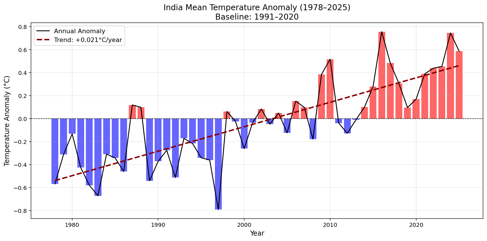
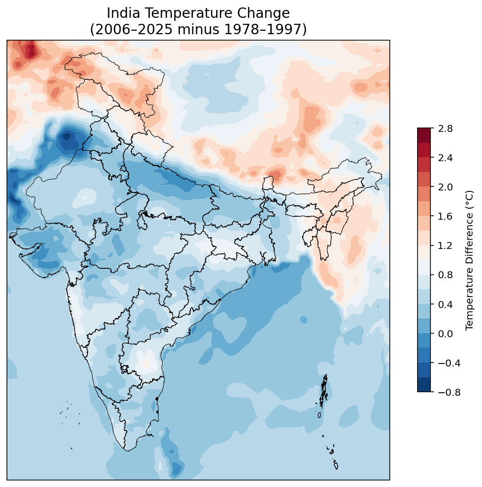

# India Climate Analysis (1978–2025)

## Overview
Analysis of India's temperature warming trends 
and heatwave patterns using ERA5 3-hourly 
reanalysis data.

## Key Findings
- Warming rate: **+0.021°C/year**
- Total warming: **~1°C** (1978–2025)
- Hottest year: **2016**
- Baseline: WMO standard 1991–2020
- Rajasthan most affected — 5400+ heatwave days

## Tools Used
- Python, Xarray, Pandas, NumPy
- Matplotlib, Cartopy, Geopandas
- SciPy, ERA5 3-hourly reanalysis data

## Plots

