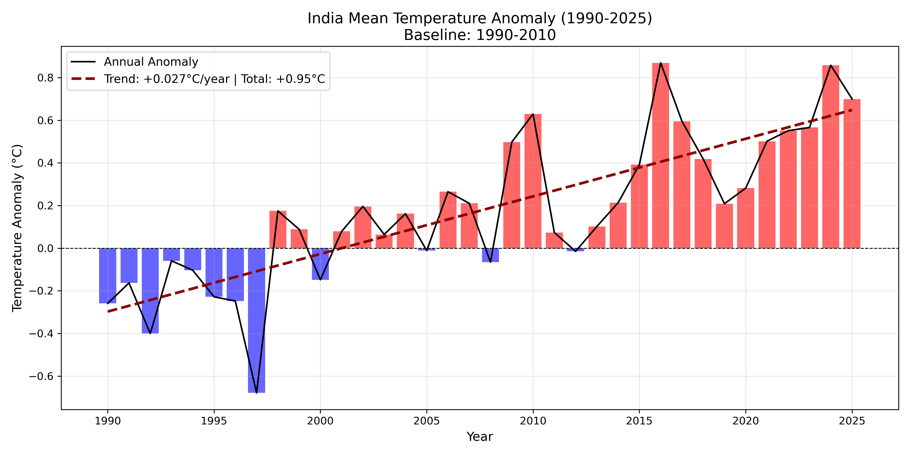
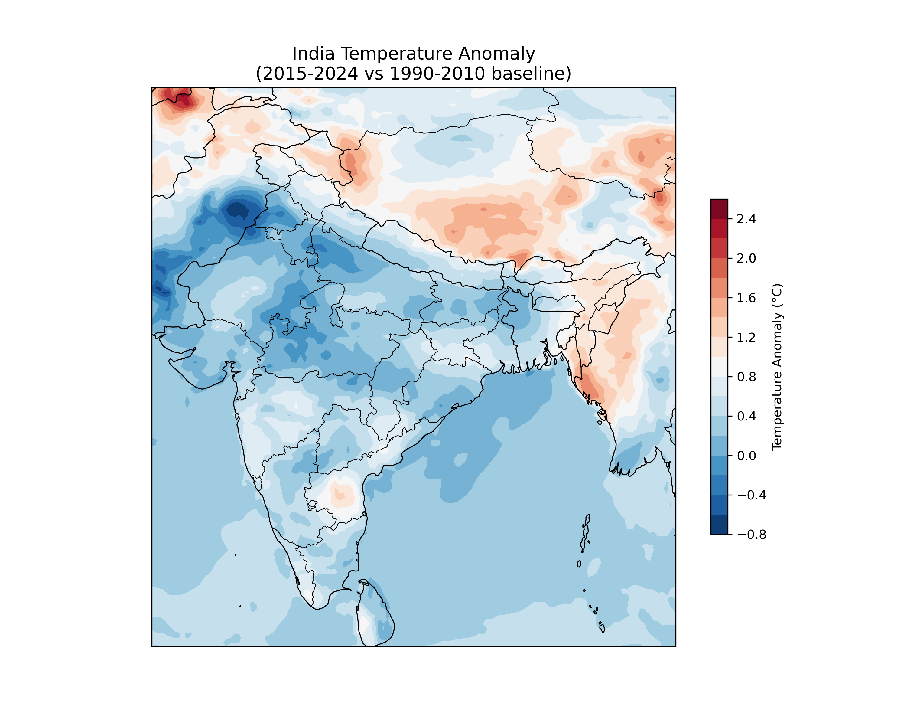
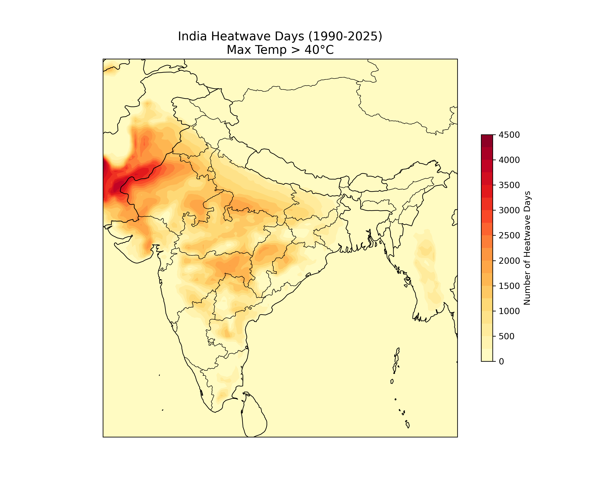

# India Climate Analysis (1990–2025)

## Overview
Analysis of India's temperature warming trends and heatwave
patterns using ERA5 3-hourly reanalysis data.

## Key Findings
- Warming rate: **+0.027°C/year**
- Total warming: **+0.95°C** (1990–2025)
- Hottest year: **2016** (+0.869°C anomaly)
- Coldest year: **1997** (-0.679°C anomaly)
- Hottest zone: **Rajasthan-Pakistan border** (4500+ heatwave days)

## Tools & Libraries
- Python, Xarray, NumPy, Pandas
- Matplotlib, Cartopy
- SciPy (trend analysis)
- ERA5 3-hourly reanalysis data

## Results

